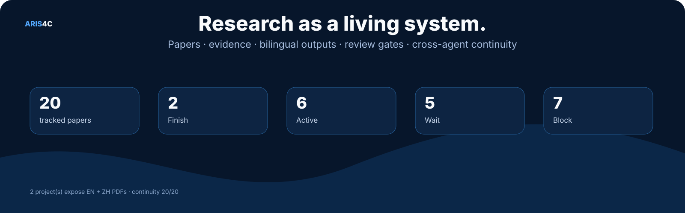
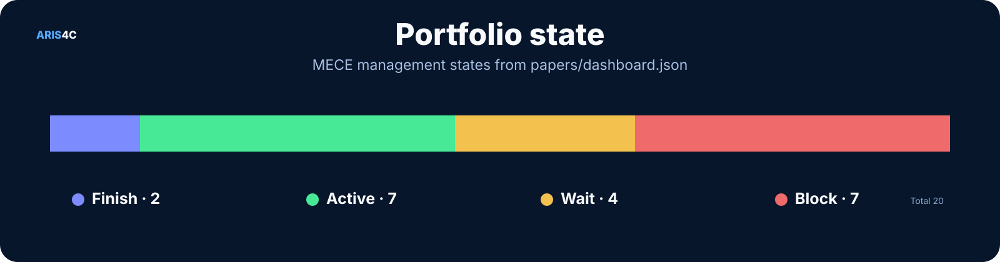
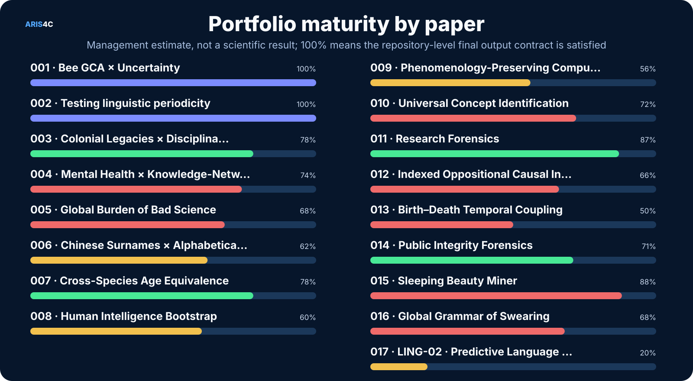
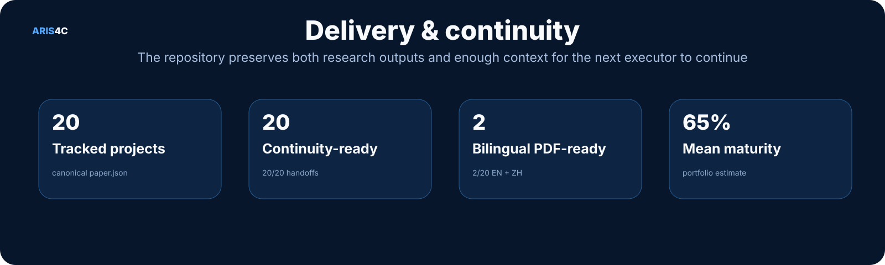

<p align="right">
  <a href="./README.en.md"></a>
  <a href="./README.md"></a>
</p>

<p align="center">
  
</p>

<p align="center">
  <a href="https://cochranek.github.io/ARIS4C/"></a>
</p>

<p align="center">
  <a href="https://github.com/CochraneK/ARIS4C/actions/workflows/build-paper-index.yml"></a>
  <a href="https://github.com/CochraneK/ARIS4C/actions/workflows/build-public-pdfs.yml"></a>
  <a href="https://github.com/CochraneK/ARIS4C/actions/workflows/sync-paper-handoffs.yml"></a>
  
</p>

# ARIS4C

**ARIS for Cochrane** is a living research portfolio for papers developed through the [ARIS](https://github.com/wanshuiyin/Auto-claude-code-research-in-sleep) workflow.

ARIS is the research engine. **ARIS4C is the canonical research system around it:** numbered papers, evidence, code, bilingual manuscripts, adaptive figures and tables, review gates, public PDFs, portfolio state, and enough handoff context for another computer, account, agent, or collaborator to continue the work from Git.

> **One repository, one canonical state, many research threads.**

## Start here

| I want to… | Go to |
|---|---|
| Take over portfolio control as another agent/account/computer | **[`000/README.md`](000/README.md)** |
| See the whole portfolio visually | **[Research Command Center](https://cochranek.github.io/ARIS4C/)** |
| Read completed papers | See **Publication-ready outputs** below |
| Continue one paper on another machine / account / agent | Open that paper's **`handoff/README.md`** |
| Check current portfolio state | [`papers/dashboard.json`](papers/dashboard.json) |
| Understand final-output requirements | [`ARIS4C_OUTPUT_STANDARD.md`](ARIS4C_OUTPUT_STANDARD.md) |
| Understand continuity requirements | [`ARIS4C_CONTINUITY_STANDARD.md`](ARIS4C_CONTINUITY_STANDARD.md) |
| Understand portfolio activity states | [`ARIS4C_STATUS_MODEL.md`](ARIS4C_STATUS_MODEL.md) |
| Understand 000 scheduling / checkpoint rules | [`ARIS4C_OPERATING_MODEL.md`](ARIS4C_OPERATING_MODEL.md) |

## Portfolio at a glance

<p align="center">
  
</p>

<p align="center">
  
</p>

<p align="center">
  
</p>

> Progress is a **portfolio-management estimate**, not a scientific result. `100%` means the repository-level final output contract is satisfied. Live execution uses four states: **Finish** = final/output contract complete; **Active** = meaningful research is moving now; **Wait** = the next step can be done but is not currently being advanced; **Block** = an external/human/data/review dependency prevents progress.

## Publication-ready outputs

- **001 · Bee GCA × Uncertainty** — [English PDF](https://cochranek.github.io/ARIS4C/paper/001/en/main.pdf) · [中文 PDF](https://cochranek.github.io/ARIS4C/paper/001/zh/main.pdf)
- **002 · Testing linguistic periodicity** — [English PDF](https://cochranek.github.io/ARIS4C/paper/002/en/main.pdf) · [中文 PDF](https://cochranek.github.io/ARIS4C/paper/002/zh/main.pdf)

## The 20-paper portfolio

| ID | Project | State | Progress | Continue from | At a glance |
|---|---|---:|---:|---|---:|
| **001** | [Bee GCA × Uncertainty](papers/001-gca-bees/) | 🔵 Finish | 100% | [handoff](papers/001-gca-bees/handoff/AGENT_HANDOFF.md) | <a href="./docs/assets/paper-at-a-glance/001.webp"></a> |
| **002** | [Testing linguistic periodicity](papers/002-language-geometry/) | 🔵 Finish | 100% | [handoff](papers/002-language-geometry/handoff/AGENT_HANDOFF.md) | <a href="./docs/assets/paper-at-a-glance/002.webp"></a> |
| **003** | [Colonial Legacies × Disciplinary Advantage](papers/003-colonial-disciplinary-advantage/) | 🟢 Active | 78% | [handoff](papers/003-colonial-disciplinary-advantage/handoff/AGENT_HANDOFF.md) | — |
| **004** | [Mental Health × Knowledge-Network Exclusion](papers/004-counterfactual-cost-of-exclusion/) | 🔴 Block | 74% | [handoff](papers/004-counterfactual-cost-of-exclusion/handoff/AGENT_HANDOFF.md) | — |
| **005** | [Global Burden of Bad Science](papers/005-hidden-burden-bad-science/) | 🔴 Block | 68% | [handoff](papers/005-hidden-burden-bad-science/handoff/AGENT_HANDOFF.md) | — |
| **006** | [Chinese Surnames × Alphabetical Exposure](papers/006-chinese-alphabetical-exposure/) | 🟡 Wait | 62% | [handoff](papers/006-chinese-alphabetical-exposure/handoff/AGENT_HANDOFF.md) | — |
| **007** | [Cross-Species Age Equivalence](papers/007-cross-species-age-equivalence/) | 🟢 Active | 78% | [handoff](papers/007-cross-species-age-equivalence/handoff/AGENT_HANDOFF.md) | — |
| **008** | [Human Intelligence Bootstrap](papers/008-human-intelligence-bootstrap/) | 🟡 Wait | 60% | [handoff](papers/008-human-intelligence-bootstrap/handoff/AGENT_HANDOFF.md) | — |
| **009** | [Phenomenology-Preserving Computational Psychiatry](papers/009-phenomenology-preserving-computational-psychiatry/) | 🟡 Wait | 56% | [handoff](papers/009-phenomenology-preserving-computational-psychiatry/handoff/AGENT_HANDOFF.md) | — |
| **010** | [Universal Concept Identification](papers/010-universal-concept-identification/) | 🔴 Block | 72% | [handoff](papers/010-universal-concept-identification/handoff/AGENT_HANDOFF.md) | — |
| **011** | [Research Forensics](papers/011-research-forensics/) | 🟢 Active | 87% | [handoff](papers/011-research-forensics/handoff/AGENT_HANDOFF.md) | — |
| **012** | [Indexed Oppositional Causal Inversion](papers/012-oppositional-causal-inversion/) | 🔴 Block | 66% | [handoff](papers/012-oppositional-causal-inversion/handoff/AGENT_HANDOFF.md) | — |
| **013** | [Birth–Death Temporal Coupling](papers/013-birth-death-temporal-coupling/) | 🔴 Block | 50% | [handoff](papers/013-birth-death-temporal-coupling/handoff/AGENT_HANDOFF.md) | — |
| **014** | [Public Integrity Forensics](papers/014-public-integrity-forensics/) | 🟢 Active | 71% | [handoff](papers/014-public-integrity-forensics/handoff/AGENT_HANDOFF.md) | — |
| **015** | [Sleeping Beauty Miner](papers/015-sleeping-beauty-miner/) | 🔴 Block | 88% | [handoff](papers/015-sleeping-beauty-miner/handoff/AGENT_HANDOFF.md) | — |
| **016** | [Global Grammar of Swearing](papers/016-global-grammar-of-swearing/) | 🔴 Block | 68% | [handoff](papers/016-global-grammar-of-swearing/handoff/AGENT_HANDOFF.md) | — |
| **017** | [LING-02 · Predictive Language Space](papers/017-predictive-language-space/) | 🟡 Wait | 20% | [handoff](papers/017-predictive-language-space/handoff/AGENT_HANDOFF.md) | — |
| **018** | [Fly Neuro Playground](papers/018-drosophila-neural-simulation/) | 🟢 Active | 82% | [handoff](papers/018-drosophila-neural-simulation/handoff/AGENT_HANDOFF.md) | — |
| **018** | [Drosophila Open Simulation](papers/018-drosophila-open-simulation/) | 🟢 Active | 82% | [handoff](papers/018-drosophila-open-simulation/handoff/AGENT_HANDOFF.md) | — |
| **019** | [Time Off × Happiness](papers/019-time-off-happiness/) | 🟢 Active | 48% | [handoff](papers/019-time-off-happiness/handoff/AGENT_HANDOFF.md) | — |

## How ARIS4C works

<p align="center">
  
</p>

The key distinction is intentional:

- **ARIS** supplies the research workflow.
- **Each numbered paper** owns its scientific evidence and decisions.
- **ARIS4C 000 / dashboard** manages the portfolio without becoming a second scientific truth.
- **`handoff/`** preserves the context needed to resume work across sessions and agents.
- **Git history** preserves superseded states rather than erasing how a paper evolved.

## Common structure of every Paper

<p align="center">
  
</p>

Every numbered Paper follows the same repository contract, while its scientific design, data, analyses, figures, and review gates remain project-specific.

## Lifecycle of a Paper

<p align="center">
  
</p>

## Final-paper contract

A submission-ready/final ARIS4C paper is expected to provide:

| Layer | Requirement |
|---|---|
| Manuscript | English full paper + Chinese full paper |
| Public delivery | English PDF + Chinese PDF |
| Visuals | Figure/table package chosen for the actual inferential structure — **no fixed “3 figures” quota** |
| Evidence | Traceable empirical / synthetic / conceptual provenance |
| Review | Required scientific / reproducibility / independent-review gates |
| Continuity | `handoff/` package with status, TODO, decisions, context, chat log, agent handoff, and session log |
| Public surface | Current links on the Research Command Center |

See [**ARIS4C Final Output Standard · v3**](ARIS4C_OUTPUT_STANDARD.md).

## Cross-agent continuity

<p align="center">
  
</p>

Every numbered paper has the same cold-start package:

```text
papers/00X-project/
└── handoff/
    ├── README.md
    ├── STATUS.md
    ├── TODO.md
    ├── DECISIONS.md
    ├── CONTEXT.md
    ├── CHATLOG.md
    ├── AGENT_HANDOFF.md
    └── SESSION_LOG.md
```

A new executor should be able to start with:

> **Read `papers/00X-.../handoff/README.md` and continue from the current repository state.**

The public repository stores **public-safe conversation summaries**, not credentials, private personal material, or hidden model chain-of-thought.

## Repository anatomy

```text
ARIS4C/
├── 000/                           # Git-resident portfolio controller handoff
├── papers/
│   ├── dashboard.json             # portfolio source of truth
│   └── 00X-project/
│       ├── paper.json             # paper metadata
│       ├── manuscript/            # EN / ZH manuscripts
│       ├── figures/ + tables/     # scientific visuals
│       ├── code/ + data/          # analysis / provenance
│       ├── process/               # design, gates, frozen decisions
│       └── handoff/               # cross-agent continuity
├── docs/                          # GitHub Pages + public PDFs
├── tools/                         # generators and audits
├── ARIS4C_OUTPUT_STANDARD.md
├── ARIS4C_CONTINUITY_STANDARD.md
├── ARIS4C_STATUS_MODEL.md
├── ARIS4C_OPERATING_MODEL.md
└── aris.lock.json                 # pinned ARIS lineage
```

## Rebuild and audit

```bash
python tools/build_papers_index.py
python tools/build_readme_assets.py
python tools/build_readme.py
python tools/audit_paper_outputs.py
python tools/audit_paper_handoffs.py
python tools/sync_paper_handoffs.py
python tools/portfolio_queue.py
```

## Design principles

1. **One canonical source of truth.** Parallel chats and agents can explore; Git decides what became canonical.
2. **Falsification before narrative.** Stronger methods are allowed to replace weaker claims.
3. **Visualize the evidence, not a quota.** Figures are chosen for information gain, not template compliance.
4. **Bilingual by default at completion.** Final public delivery is English + Chinese and PDF-first.
5. **Research must be resumable.** A project that another agent cannot safely continue is operationally incomplete.
6. **Anomalies are not verdicts.** Forensics-oriented projects preserve human review and explicit uncertainty.
7. **Finish what is closest first.** 000 continues genuine Active work first, then promotes the highest-progress Wait paper, with bounded-unit Git checkpoints before switching.

---

Maintainer: **CochraneK**  
Research hub: **https://cochranek.github.io/ARIS4C/**
