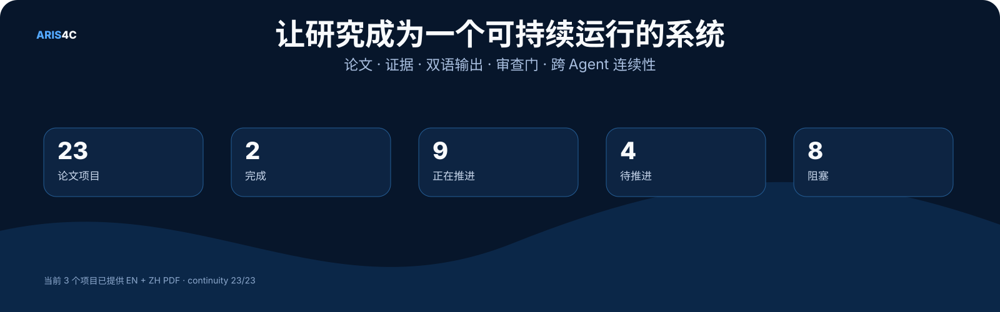
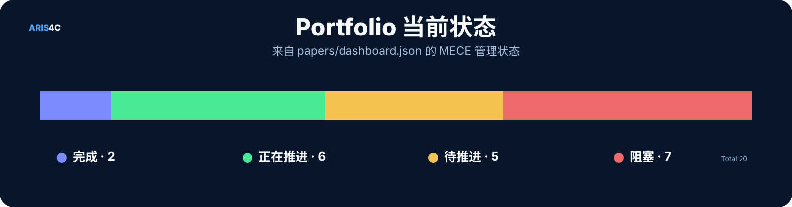
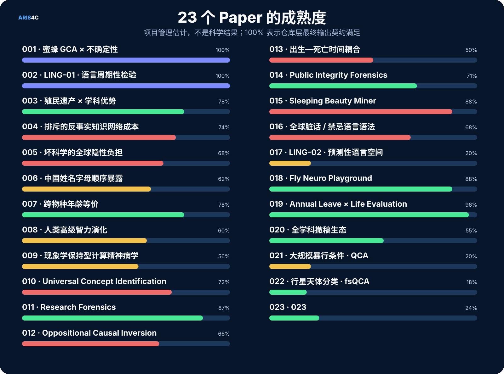
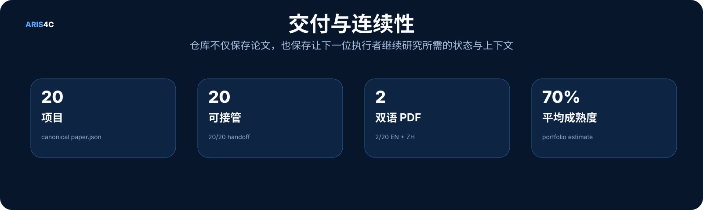

<p align="right">
  <a href="./README.en.md"></a>
  <a href="./README.md"></a>
</p>

<p align="center">
  
</p>

<p align="center">
  <a href="https://cochranek.github.io/ARIS4C/"></a>
</p>

<p align="center">
  <a href="https://github.com/CochraneK/ARIS4C/actions/workflows/build-paper-index.yml"></a>
  <a href="https://github.com/CochraneK/ARIS4C/actions/workflows/build-public-pdfs.yml"></a>
  <a href="https://github.com/CochraneK/ARIS4C/actions/workflows/sync-paper-handoffs.yml"></a>
  
</p>

# ARIS4C

**ARIS for Cochrane** 是一个通过 [ARIS](https://github.com/wanshuiyin/Auto-claude-code-research-in-sleep) 持续推进论文的长期研究组合与 canonical 仓库。

ARIS 是研究引擎；**ARIS4C 是围绕论文建立的完整研究系统**：编号项目、证据、代码、中英文稿、针对性图表、审查门、公开 PDF、portfolio 状态，以及让另一台电脑、另一个账号、另一个 Agent 或协作者可以直接从 Git 接管研究所需的上下文。

> **一个仓库，一个 canonical state，多条并行研究线程。**

## 从这里开始

| 你想做什么 | 入口 |
|---|---|
| 让另一个 Agent / 账号 / 电脑接管总控 | **[`000/README.md`](000/README.md)** |
| 可视化查看全部项目 | **[Research Command Center](https://cochranek.github.io/ARIS4C/)** |
| 阅读已完成论文 | 见下方 **已达到公开交付状态的论文** |
| 换电脑 / 账号 / Agent 继续某篇论文 | 打开该项目的 **`handoff/README.md`** |
| 查看当前 portfolio 状态 | [`papers/dashboard.json`](papers/dashboard.json) |
| 查看最终输出标准 | [`ARIS4C_OUTPUT_STANDARD.md`](ARIS4C_OUTPUT_STANDARD.md) |
| 查看跨 Agent 接管标准 | [`ARIS4C_CONTINUITY_STANDARD.md`](ARIS4C_CONTINUITY_STANDARD.md) |
| 查看项目状态分类规则 | [`ARIS4C_STATUS_MODEL.md`](ARIS4C_STATUS_MODEL.md) |
| 查看 000 调度 / 落盘规则 | [`ARIS4C_OPERATING_MODEL.md`](ARIS4C_OPERATING_MODEL.md) |

## 当前研究组合

<p align="center">
  
</p>

<p align="center">
  
</p>

<p align="center">
  
</p>

> Progress 是**项目管理估计**，不是科学结果。`100%` 表示仓库层面的最终输出契约已经满足。实时执行状态固定为四类：**Finish / 完成** = 已满足当前 final/output contract；**Active / 正在推进** = 近期确实有实质研究推进或 research job 正在运行；**Wait / 待推进** = 下一步可以做，但当前没有实际推进；**Block / 阻塞** = 必须等待外部、人类、独立审查、数据传输等依赖。

## 已达到公开交付状态的论文

- **001 · 蜜蜂 GCA × 不确定性** — [English PDF](https://cochranek.github.io/ARIS4C/paper/001/en/main.pdf) · [中文 PDF](https://cochranek.github.io/ARIS4C/paper/001/zh/main.pdf)
- **002 · LING-01 · 语言周期性检验** — [English PDF](https://cochranek.github.io/ARIS4C/paper/002/en/main.pdf) · [中文 PDF](https://cochranek.github.io/ARIS4C/paper/002/zh/main.pdf)

## 20 个 Paper

| ID | 项目 | 状态 | 进度 | 接管入口 | 一图读懂 |
|---|---|---:|---:|---|---:|
| **001** | [蜜蜂 GCA × 不确定性](papers/001-gca-bees/) | 🔵 完成 | 100% | [handoff](papers/001-gca-bees/handoff/AGENT_HANDOFF.md) | <a href="./docs/assets/paper-at-a-glance/001.webp"></a> |
| **002** | [LING-01 · 语言周期性检验](papers/002-language-geometry/) | 🔵 完成 | 100% | [handoff](papers/002-language-geometry/handoff/AGENT_HANDOFF.md) | <a href="./docs/assets/paper-at-a-glance/002.webp"></a> |
| **003** | [殖民遗产 × 学科优势](papers/003-colonial-disciplinary-advantage/) | 🟢 正在推进 | 78% | [handoff](papers/003-colonial-disciplinary-advantage/handoff/AGENT_HANDOFF.md) | — |
| **004** | [排斥的反事实知识网络成本](papers/004-counterfactual-cost-of-exclusion/) | 🔴 阻塞 | 74% | [handoff](papers/004-counterfactual-cost-of-exclusion/handoff/AGENT_HANDOFF.md) | — |
| **005** | [坏科学的全球隐性负担](papers/005-hidden-burden-bad-science/) | 🔴 阻塞 | 68% | [handoff](papers/005-hidden-burden-bad-science/handoff/AGENT_HANDOFF.md) | — |
| **006** | [中国姓名字母顺序暴露](papers/006-chinese-alphabetical-exposure/) | 🟡 待推进 | 62% | [handoff](papers/006-chinese-alphabetical-exposure/handoff/AGENT_HANDOFF.md) | — |
| **007** | [跨物种年龄等价](papers/007-cross-species-age-equivalence/) | 🟢 正在推进 | 78% | [handoff](papers/007-cross-species-age-equivalence/handoff/AGENT_HANDOFF.md) | — |
| **008** | [人类高级智力演化 Bootstrap](papers/008-human-intelligence-bootstrap/) | 🟡 待推进 | 60% | [handoff](papers/008-human-intelligence-bootstrap/handoff/AGENT_HANDOFF.md) | — |
| **009** | [现象学保持型计算精神病学](papers/009-phenomenology-preserving-computational-psychiatry/) | 🟡 待推进 | 56% | [handoff](papers/009-phenomenology-preserving-computational-psychiatry/handoff/AGENT_HANDOFF.md) | — |
| **010** | [Universal Concept Identification](papers/010-universal-concept-identification/) | 🔴 阻塞 | 72% | [handoff](papers/010-universal-concept-identification/handoff/AGENT_HANDOFF.md) | — |
| **011** | [Research Forensics](papers/011-research-forensics/) | 🟢 正在推进 | 87% | [handoff](papers/011-research-forensics/handoff/AGENT_HANDOFF.md) | — |
| **012** | [Oppositional Causal Inversion](papers/012-oppositional-causal-inversion/) | 🔴 阻塞 | 66% | [handoff](papers/012-oppositional-causal-inversion/handoff/AGENT_HANDOFF.md) | — |
| **013** | [出生—死亡时间耦合](papers/013-birth-death-temporal-coupling/) | 🔴 阻塞 | 50% | [handoff](papers/013-birth-death-temporal-coupling/handoff/AGENT_HANDOFF.md) | — |
| **014** | [Public Integrity Forensics](papers/014-public-integrity-forensics/) | 🟢 正在推进 | 71% | [handoff](papers/014-public-integrity-forensics/handoff/AGENT_HANDOFF.md) | — |
| **015** | [Sleeping Beauty Miner](papers/015-sleeping-beauty-miner/) | 🔴 阻塞 | 88% | [handoff](papers/015-sleeping-beauty-miner/handoff/AGENT_HANDOFF.md) | — |
| **016** | [全球脏话 / 禁忌语言语法](papers/016-global-grammar-of-swearing/) | 🔴 阻塞 | 68% | [handoff](papers/016-global-grammar-of-swearing/handoff/AGENT_HANDOFF.md) | — |
| **017** | [LING-02 · 预测性语言空间](papers/017-predictive-language-space/) | 🟡 待推进 | 20% | [handoff](papers/017-predictive-language-space/handoff/AGENT_HANDOFF.md) | — |
| **018** | [Fly Neuro Playground](papers/018-drosophila-neural-simulation/) | 🟡 待推进 | 12% | [handoff](papers/018-drosophila-neural-simulation/handoff/AGENT_HANDOFF.md) | — |
| **018** | [Drosophila Open Simulation](papers/018-drosophila-open-simulation/) | 🟡 待推进 | 12% | [handoff](papers/018-drosophila-open-simulation/handoff/AGENT_HANDOFF.md) | — |
| **019** | [Time Off × Happiness](papers/019-time-off-happiness/) | 🟡 待推进 | 15% | [handoff](papers/019-time-off-happiness/handoff/AGENT_HANDOFF.md) | — |

## ARIS4C 如何运作

<p align="center">
  
</p>

关键分工：

- **ARIS** 提供研究流程。
- **每一个 numbered paper** 拥有自己的科学证据和决策。
- **ARIS4C 000 / dashboard** 管 portfolio，但不成为第二套科学真相。
- **`handoff/`** 保存跨对话、跨账号、跨 Agent 继续研究所需的上下文。
- **Git history** 保存被替代的旧版本，而不是抹掉研究如何演化。

## 每篇 Paper 的通用结构

<p align="center">
  
</p>

所有编号项目遵循同一套仓库结构与交付契约；真正的研究设计、数据、分析、图表和审查门则由各自科学问题决定。

## 一篇 Paper 的生命周期

<p align="center">
  
</p>

## Final Paper 标准

一个 submission-ready / final 的 ARIS4C Paper 默认需要：

| 层 | 要求 |
|---|---|
| 论文 | 英文完整论文 + 中文完整论文 |
| 公开交付 | English PDF + 中文 PDF |
| 图表 | 根据论文真正的推断结构设计，**不固定 3 张图，也不固定图型** |
| 证据 | empirical / synthetic / conceptual provenance 可追踪 |
| 审查 | 对应的科学、复现、独立 review gate |
| 连续性 | `handoff/` 包含状态、TODO、决策、上下文、对话记录、Agent 接管说明和 session log |
| 公开入口 | Research Command Center 中的链接保持最新 |

详见 [**ARIS4C Final Output Standard · v3**](ARIS4C_OUTPUT_STANDARD.md)。

## 跨电脑 / 账号 / Agent 连续性

<p align="center">
  
</p>

每一个编号项目现在都有统一目录：

```text
papers/00X-project/
└── handoff/
    ├── README.md
    ├── STATUS.md
    ├── TODO.md
    ├── DECISIONS.md
    ├── CONTEXT.md
    ├── CHATLOG.md
    ├── AGENT_HANDOFF.md
    └── SESSION_LOG.md
```

新的执行者原则上只需要：

> **先读 `papers/00X-.../handoff/README.md`，然后从当前 Git 状态继续。**

公开仓库里的 CHATLOG 保存的是 **public-safe 的研究对话摘要**，不会写入 API key、私密凭证、不必要的个人敏感信息或模型隐藏 chain-of-thought。

## 仓库结构

```text
ARIS4C/
├── papers/
│   ├── dashboard.json             # portfolio canonical state
│   └── 00X-project/
│       ├── paper.json             # paper metadata
│       ├── manuscript/            # 中英文论文
│       ├── figures/ + tables/     # 科学图表
│       ├── code/ + data/          # 分析 / provenance
│       ├── process/               # 设计、gate、冻结决策
│       └── handoff/               # 跨 Agent continuity
├── docs/                          # GitHub Pages + public PDFs
├── tools/                         # generators + audits
├── ARIS4C_OUTPUT_STANDARD.md
├── ARIS4C_CONTINUITY_STANDARD.md
├── ARIS4C_STATUS_MODEL.md
└── aris.lock.json
```

## 重建与审计

```bash
python tools/build_papers_index.py
python tools/build_readme_assets.py
python tools/build_readme.py
python tools/audit_paper_outputs.py
python tools/audit_paper_handoffs.py
python tools/sync_paper_handoffs.py
```

## 设计原则

1. **唯一 canonical source of truth。** 多个对话框和 Agent 可以并行探索，但 Git 决定什么真正进入 main。
2. **先可证伪，再讲故事。** 更强的方法可以替代更弱的旧结论。
3. **图表服务证据，不服务配额。** 不固定 3 张图，以信息增益决定图型和数量。
4. **完成时默认双语。** Final public delivery 使用 English + 中文，并优先 PDF。
5. **研究必须可接管。** 如果换一个 Agent 就无法继续，这个项目在 operational 层面就还没完成。
6. **异常不是定罪。** Forensics 类项目保留 human review、证据边界和明确的不确定性。
7. **优先完成最接近完成的项目。** 000 先续跑真正的 Active；有空闲槽位时，从 Wait 中按进度从高到低启动，并在切换 Paper 前完成 bounded-unit Git checkpoint。

---

维护者：**CochraneK**  
Research hub：**https://cochranek.github.io/ARIS4C/**
