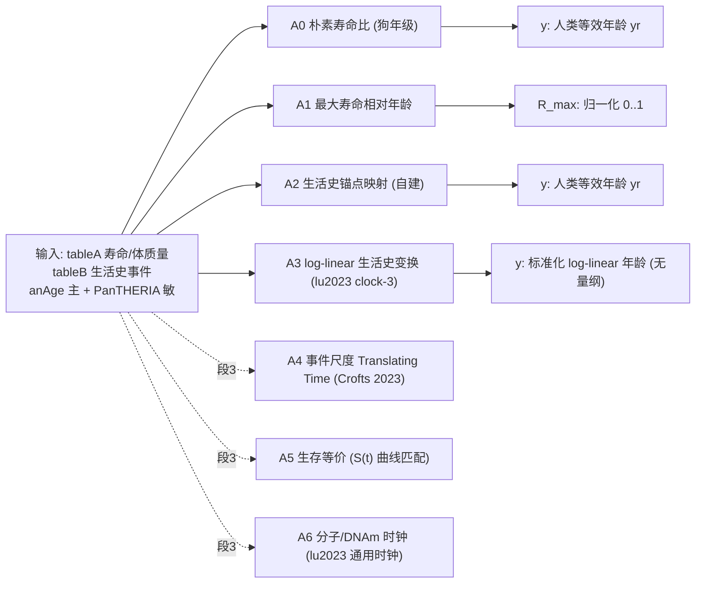

# Fig.1 (主图 #1): A0–A6 跨物种年龄等价方法图谱
状态: stage2b (2026-09-29)。A0–A3 已实现 (code/)；A4–A6 仅概念（属段3, 本会话不实现）。
参照系约定: 人类日历年龄 (出生=0)；输入全部来自冻结表 tableA/tableB（lu2023 MOESM3 快照, 2026-09-30）。

## 总览

## 方法卡 (输入 / 输出坐标 / 已知局限)
| ID | 输入 | 输出坐标 | 已知局限 | 状态 |
|----|------|----------|----------|------|
| A0 | tableA: 寿命代理=anAge max_age_yrs (快照无典型寿命列, 已声明), PT 交叉核验 | 人类等效年龄 yr | L_max 高估典型寿命→弱基线(设计使然); 纯线性; 忽略生活史形态; 人自身=恒等 | 已实现 code/a0 |
| A1 | tableA: L_max (anAge 主 + PanTHERIA 交叉) | R_max=a/L_max ∈ [0,1] (归一化, 非人类年) | 每物种仅 1 标量; 对己方 L_max 的网格上 R≡q(恒等); 不描述寿命内形态 | 已实现 code/a1 |
| A2 | tableB 锚点龄 (conception/birth/weaning/sexual_maturity_female; anAge 主, PT 行敏感); 人类 anAge 锚点为参照 | 人类等效年龄 yr | 逐段线性; 性成熟后仅线性外推(老年粗糙); PT 行缺失(猫无 weaning_PT); 无外部基线(Animal-Age GitHub 0 结果→自建) | 已实现 code/a2 |
| A3 | tableA G=gestation, ASM=female_maturity (anAge 主); ASM_PT 来自 tableB sexual_maturity_PanTHERIA; G 无 PT 行→共享 (已声明) | 标准化 log-linear 年龄 y (无量纲, 跨物种可比) | 指数 0.38 与 c2=5 为论文固定常数; 默认版不依赖 L_max; oracle m*(formula 6, 1.3×校正) 仅稳健性, 不作默认 | 已实现 code/a3 |
| A4 | (段3) 事件时刻 (断奶/成熟/初产) 而非日历龄; Crofts 2023 "Translating Time" | 事件尺度等效年龄 | 概念: tableB PT 行稀疏→事件覆盖不对称; 公式提取需重读 XML (本会话禁读); 无实现 | 段3 概念 |
| A5 | (段3) 跨物种存活曲线 S(t)/年龄特异性风险 | 生存等价年龄 | 概念: 冻结表无存活数据 (段1范围仅寿命+事件); 需外部死亡率数据, 未在工作区 | 段3 概念 |
| A6 | (段3) lu2023 通用 DNAm 时钟 (s3_clock1/2/3 权重在盘) + 物种甲基化谱 | DNAm 年龄 (人类等效) | 概念: 无输入甲基化数据; 时钟训练细节/组织来源需从文献再提取; 权重在盘但不可直接应用 | 段3 概念 |

## 表 E 输出约定 (data/tableE_partial.csv)
- 网格: 9 物种 × q∈{0.25,0.50,0.75,0.90,0.95,0.99}, a_q=q·L_max,anAge (该物种 0→L_max 相对位置)。
- 每格=区间 [out_low, out_high] + out_mid (双输入 anAge/PanTHERIA 下), 不压成单点。
- out_unit: A0/A2=human_eq_years; A1=relative_age_0_1; A3=std_loglinear_y。
