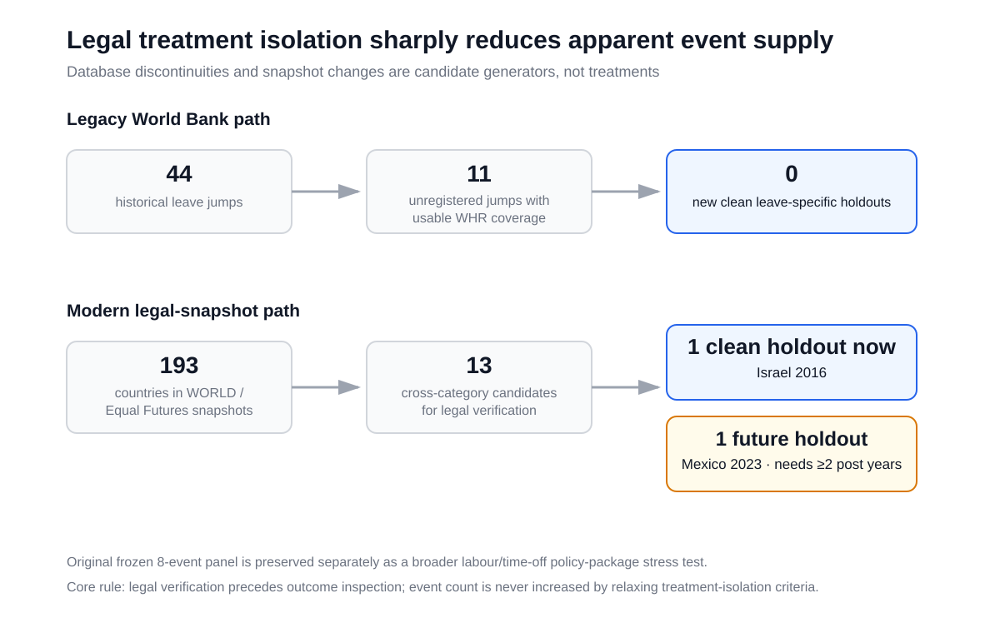
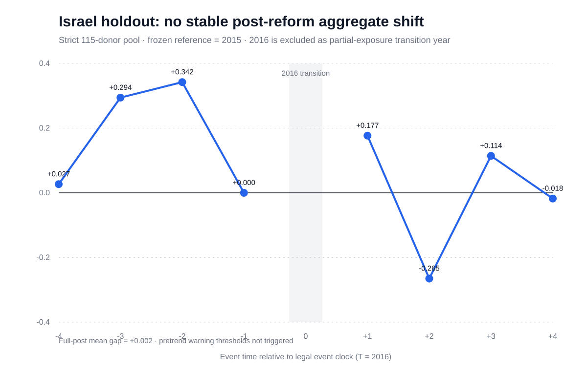
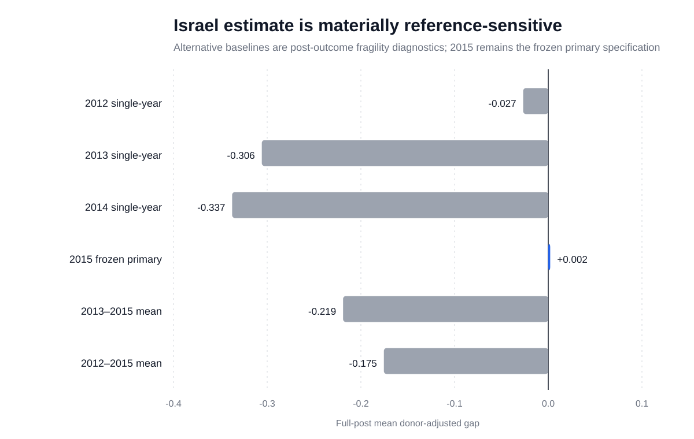

# Statutory Paid Annual Leave and National Life Evaluation

## A Global Legal-Event Audit and Falsification-First Holdout Study

### Abstract

Paid annual leave is widely justified as a protection for rest, health, and work–life balance, but its population-level effect on life evaluation is difficult to identify because legal changes are infrequent, often bundled with other labour reforms, and affect only part of the population. We combine annual Gallup/World Happiness Report Life Ladder data with verified legal reform timing and an outcome-blind treatment-isolation workflow. An initial eight-event panel produced a positive donor-adjusted mean (+0.110) but a negative median (−0.099). Updating the frozen design through 2023 reduced the mean to +0.088, with six of eight event means negative; excluding the influential Bahrain event produced −0.117. Legal review showed that most events were broader labour or time-off packages. A bounded audit of 11 additional historical database discontinuities admitted no new clean annual-leave holdout. We then used independent legal snapshots to discover, legally verify, and prospectively freeze Israel’s 2016 leave-specific reform before inspecting its outcome. The pre-frozen 115-country donor design yielded a full-post mean gap of +0.002 without triggering prespecified pretrend warnings, but post-outcome alternative-baseline diagnostics ranged materially negative. The evidence therefore does not show a robust, directionally stable population Life Ladder response to statutory annual-leave reform. More broadly, the study shows how legal treatment isolation, exposure–outcome alignment, source-version auditing, and prospective holdouts can change conclusions in cross-national social-indicator research.

**Keywords:** paid annual leave; life evaluation; social indicators; legal epidemiology; causal inference; quality of life

---

## 1. Introduction

Paid annual leave occupies an unusual place in research on work and well-being. It is simultaneously a labour standard, a mechanism for recovery from work, a component of work–life balance, and a policy instrument whose legal design varies substantially across countries. The International Labour Organization (ILO) treats paid annual leave as part of working-time protection and emphasizes its role in limiting the indefinite extension of work across the year, protecting physical and mental health, facilitating work–life balance, and supporting sustainable productivity (International Labour Organization, 2026). These rationales are intuitively compatible with a simple expectation: if a country increases workers’ legal entitlement to paid annual leave, population well-being may improve.

That expectation is plausible, but the corresponding empirical question is more difficult than it first appears. Evidence that vacations improve worker recovery does not by itself show that a one- or two-day statutory entitlement change will move a national average of life evaluation. Evidence that shorter workweeks improve job satisfaction does not identify the effect of annual leave. Cross-sectional comparisons between countries with more and fewer vacation days are especially difficult to interpret because leave generosity is correlated with income, labour-market institutions, welfare-state design, enforcement capacity, working culture, and many other determinants of subjective well-being.

The outcome also matters. The World Happiness Report (WHR) is sometimes described in public discussion as if it were a composite index mechanically combining gross domestic product, social support, freedom, generosity, and corruption. It is not. Its central country ranking is based on a single life-evaluation item, the Cantril Ladder, in which respondents place their current life on a scale from 0 (worst possible life) to 10 (best possible life) (World Happiness Report, 2026). The explanatory variables commonly shown alongside the ranking are used to understand variation in life evaluation; they are not ingredients summed into the outcome. For a policy event study, annual Life Ladder observations are preferable to multi-year ranking averages because annual trajectories preserve temporal information around reforms.

A second difficulty is legal measurement. A database may show a discontinuity in the number of leave days without that discontinuity representing a clean national reform. The jump can reflect a change in coding conventions, conversion between calendar and working days, a tenure-profile update, a subnational law, or a broad labour code that changes multiple policies simultaneously. Conversely, a legally real reform may be absent from a historical database or may appear with a reporting lag. Treating every numerical jump as a causal treatment therefore creates a treatment-definition problem before any statistical estimator is chosen.

This study addresses these problems with a falsification-first workflow. The central question is not whether a favorable coefficient can be found, but whether a stable population-level Life Ladder response survives progressively stricter treatment definition and robustness checks. The study proceeds in five stages. First, it freezes an eight-event panel of legally verified reforms with historical outcome coverage. Second, it estimates transparent donor-adjusted changes and modern staggered-treatment diagnostics. Third, it repeats the frozen design using a newer annual WHR release, separating backfilled observations from later follow-up. Fourth, it conducts bounded legal audits to determine whether apparently promising database jumps can actually be treated as annual-leave reforms. Fifth, after the original analysis, it discovers and prospectively freezes an independent, cleaner Israeli annual-leave reform before opening that event’s Life Ladder outcome.

This sequence produces a more cautious result than the initial pooled mean suggested. The original panel contains substantial policy bundling and is highly sensitive to one event. The newer WHR release further weakens the positive pooled pattern. The historical legal queue yields no additional clean holdouts. The independent Israel holdout produces a near-zero estimate under the prospectively frozen last-pre-year normalization, but the magnitude and sign are sensitive to post-outcome alternative reference baselines. The appropriate conclusion is therefore not that paid annual leave makes countries happier, and not that annual leave has no well-being value. Rather, the available annual national data do not reveal a robust, directionally stable population Life Ladder response that can be cleanly attributed to statutory annual-leave entitlement.

The contribution is consequently both substantive and methodological. Substantively, the study provides evidence about an under-studied policy margin: statutory annual-leave reform at the national level. Methodologically, it demonstrates that legal-event reconstruction, exposure–outcome alignment, source-version auditing, and independent holdouts can materially alter the apparent interpretation of cross-national social-indicator data.

## 2. Related Literature and Conceptual Distinctions

### 2.1 Actual vacations and worker recovery

A substantial literature concerns the experience of taking vacation rather than the legal entitlement to vacation. This distinction is fundamental. Legal entitlement is an institutional exposure; actual vacation is a realized behavior. Between the two lie eligibility, enforcement, take-up, workload constraints, employer practices, scheduling, and worker preferences.

Early longitudinal work found short-term improvements in several indicators of well-being after vacation. Strauss-Blasche et al. (2000), studying employees before and after vacation, reported improvements in physical complaints, sleep quality, and mood shortly after time away from work, while average life satisfaction did not change. More recently, Grant et al. (2025) synthesized 32 studies and 256 effect sizes and concluded that vacations are a meaningful recovery opportunity for employee well-being, with evidence that benefits can persist longer than older reviews suggested. Their moderator analyses also emphasize that vacation length, recovery experiences, and context matter.

These findings provide a credible mechanism through which time away from work can improve worker well-being. They do not, however, establish the estimand studied here. A national statutory reform can increase the legal minimum for only a subset of employees, may not change leave use one-for-one, and is evaluated here against a population-wide Life Ladder measure rather than a worker-specific recovery or job-satisfaction outcome.

### 2.2 Working-time reductions

A second adjacent literature studies reductions in weekly working hours. Lepinteur (2019) used reforms in Portugal and France and found increases in job and leisure satisfaction among affected workers after reductions in standard weekly hours. The estimated gains were concentrated in dimensions closely related to working conditions and hours. A systematic review by Voglino et al. (2022) likewise found generally favorable patterns for sleep, stress, and working-life quality in reduced-working-time interventions, while evidence for broader general health and well-being outcomes remained less certain.

Weekly-hours reforms and annual-leave reforms both alter the allocation of time between paid work and non-work, but they are not interchangeable. A reduction of several hours every week changes recurring daily and weekly constraints. An extra day or two of annual leave changes a more episodic form of recovery opportunity. Weekly-hours reforms may also affect organizational routines and workload differently from annual leave. The current study therefore treats the working-time literature as mechanism-relevant but not as direct evidence for the national annual-leave estimand.

### 2.3 Paid vacation availability and mental health

Longitudinal individual-level evidence also suggests that access to paid vacation can be associated with mental-health outcomes. Kim (2019), using a nationally representative longitudinal sample in the United States, reported that more paid vacation days were associated with lower odds of depression among women, with heterogeneity across subgroups. The author appropriately noted the assumptions required to translate observational associations into policy effects.

Again, this is a different level of exposure and outcome from the present study. Employer-provided paid vacation can vary within a country and may be related to job quality, occupation, earnings, and employer characteristics. A national statutory minimum is a policy floor, not a direct measure of the days a particular person can or does take. The difference is one reason why worker-level evidence can coexist with a small or unstable population-level national effect.

### 2.4 Cross-national policy and happiness

Cross-national research has connected family and work policies with subjective well-being. Chao and Glass (2020), for example, examined parents and non-parents in Asian countries and found that work–family policy arrangements, including paid annual leave, were associated with variation in parental happiness. Their design is valuable for understanding policy context and heterogeneity but is not a reform-based event study of national Life Ladder.

This literature highlights a broader conceptual issue. Policies rarely operate in isolation. Countries with generous annual leave may also have maternity leave, parental leave, flexible scheduling rights, collective bargaining institutions, shorter normal hours, or stronger income protection. Static country-level policy variables can therefore behave as markers of broader institutional regimes. A reform design has the potential to reduce some cross-sectional confounding, but only if the reform itself is sufficiently isolated.

### 2.5 Why a national Life Ladder effect may be small even when vacations help workers

The distinction between worker-level benefit and population-level policy effect can be expressed as an exposure-dilution problem. Suppose a statutory reform increases entitlement by one day for employees below a tenure threshold. The treatment does not directly apply to children, retirees, people outside paid employment, or workers already receiving a more generous contractual entitlement. Some legally treated workers may not take the additional day. Some may take it but compensate through intensified work before or after leave. Even among users, the most responsive outcomes may be fatigue, stress, recovery, family time, or job satisfaction rather than global life evaluation.

National Life Ladder is deliberately broad: respondents evaluate their life as a whole. That breadth is useful for assessing social conditions, but it also means that modest labour-policy changes compete with many larger determinants and shocks. The expected signal-to-noise ratio of a small leave reform may therefore be low. A weak aggregate effect is compatible with meaningful benefits among exposed workers and does not logically contradict the vacation-recovery literature.

### 2.6 The empirical gap

The literature reviewed above supports mechanisms linking time off with well-being, but it does not provide a directly analogous global quasi-experimental design for leave-specific statutory reforms and annual national Life Ladder. A targeted literature search conducted for this project identified studies of vacations, paid vacation availability, shorter workweeks, and cross-national policy associations, but not a close counterpart that combines exact national annual-leave reform timing, annual Life Ladder, legal treatment-isolation auditing, and a prospectively frozen post-discovery holdout. This should be read as a description of the search result, not as a claim that no related study exists.

## 3. Data and Legal Sources

### 3.1 Life Ladder outcome

The primary outcome is the annual national mean of the Gallup World Poll Cantril Ladder as distributed in historical WHR data. Respondents evaluate their current life on a 0–10 ladder. The measure is a life evaluation rather than an affect scale, and it should not be interpreted as a composite of the explanatory factors displayed in WHR analyses (Helliwell et al., 2024; World Happiness Report, 2026).

The first outcome analysis used the WHR 2023 historical annual workbook through 2022. Before estimating effects, the project froze the outcome definition, prohibited interpolation of missing country-years, and kept positive and negative affect closed as secondary outcomes. This outcome firewall was intended to limit the possibility of switching outcomes after observing an unfavorable or ambiguous primary result.

A later source audit identified a WHR 2024 annual panel extending through 2023. Because the original analysis had already been viewed, the newer source was treated as a post-unlock robustness layer rather than silently replacing the first-look dataset. The transport copy was pinned to an immutable repository commit and checked against published WHR 2024 summary statistics and selected annual values. The 2023 and 2024 releases shared 2,199 country-year Life Ladder observations that were identical at published three-decimal precision. The newer release added 26 observations dated 2022 that had not appeared in the older file and 138 observations in 2023.

The current public-data boundary matters for later reforms. WHR 2025 and 2026 public Figure 2.1 files provide multi-year averages for country rankings rather than the annual country-year observations required by the event-time design. Those rolling averages are not treated as annual outcomes and are not algebraically inverted to manufacture annual values.

### 3.2 Historical leave-law screening

The initial policy screen used the World Bank Employing Workers historical regulation panel. The dataset provides standardized measures of employment regulation, including statutory annual-leave fields across different tenure profiles. These variables are useful for identifying candidate discontinuities, but they are not treated as final legal authority.

Each candidate reform was therefore checked against primary or official legal materials. The legal source determines whether a reform occurred and when it became effective. The World Bank panel serves as corroboration and as a conservative contamination screen for donor countries.

This distinction became important in practice. Some World Bank jumps were not matched by a contemporaneous national leave-law change. Others reflected broad labour legislation, subnational coverage, tenure-profile changes, or likely working-day/calendar-day recoding. Conversely, the United Kingdom provides an example in which a legally documented phased reform is not represented as a corresponding historical discontinuity in the World Bank panel. The design therefore avoids both false positives from database jumps and false negatives from missing database changes.

### 3.3 Modern legal snapshots

To discover reforms after the older World Bank panel, the study compares two legal snapshots using a closely aligned construct. The legacy WORLD Policy Analysis Center annual-leave map reflects a systematic review of laws in all 193 UN member states as of April 2015, with more recent detail for some OECD countries through September 2016. Equal Futures released an updated Annual Leave and Weekly Rest dataset covering all 193 UN member states as of January 2026.

Both sources focus on a national legal minimum and report the lowest guaranteed paid annual leave available to a worker with at least one year of tenure. Equal Futures also records tenure requirements and coverage for agricultural and domestic workers. The 2026 data are used according to their research-use terms; the raw dataset is not redistributed in this project. Only derived candidate classifications, provenance, and audit results are retained.

A change in snapshot category is not itself a treatment. It merely identifies countries that deserve legal follow-up. This rule is important because a difference between 2015/16 and 2026 does not reveal the year of change, whether the change was national, whether it was bundled, or whether it reflects a revision in coding.

### 3.4 Legal timing and scope

For admitted events, exact dates were sought from enacted statutes, official legal databases, parliamentary records, government implementation notices, or ILO legal repositories. Events were assigned scope flags for broad labour-code packages, multistage reforms, jurisdiction-limited reforms, and major macro-event overlap.

This legal review is not an appendix to the statistical analysis; it defines the treatment. The study’s central methodological claim is that estimator sophistication cannot compensate for an exposure that has not been isolated conceptually and legally.

## 4. Design and Falsification-First Workflow

### 4.1 Pre-outcome freeze

Before inspecting post-reform Life Ladder effects in the original panel, the study froze:

- the primary outcome;
- event-time construction;
- treatment tiers;
- donor eligibility;
- macro covariates;
- robustness families;
- failure conditions;
- an explicit outcome firewall.

The primary exposure was defined as a verified statutory paid annual-leave reform. Public holidays, weekly hours, actual annual hours, and leave utilization were excluded from the exposure definition even when they were conceptually related.

The purpose of the freeze was not to claim full preregistration in the formal registry sense. It was to create an auditable separation between decisions made before and after outcome inspection inside the project repository.

### 4.2 Event clock

Event time is anchored to the verified legal effective year, denoted T. The pre-period covers T−4 through T−1. The final full untreated calendar year, T−1, is the reference period.

If a reform becomes effective on January 1, the legal year can be treated as fully exposed. If a reform becomes effective after January 1, year T is classified as a transition year and excluded from event estimation; full post exposure begins at T+1. The post window ends at T+4. Missing Life Ladder years remain missing.

This convention prevents a partly exposed year from being misclassified as pre-treatment. It also makes the legal event itself, rather than a convenient survey observation, define the clock.

### 4.3 Treatment tiers and original event pool

The original event inventory classified events according to legal verification, outcome coverage, and independent World Bank corroboration. The headline Pilot-0 pool included eight Tier-A events: Bahrain, Canada, China, Croatia, Kosovo, Kuwait, Luxembourg, and Taiwan.

Importantly, “Tier A” initially meant that timing was legally verified and the historical panel moved in a direction compatible with the reform. It did not mean that the reform changed only annual leave. The later treatment-isolation audit revealed that several Tier-A events were embedded in broader policy packages. This distinction is retained rather than rewriting the original freeze after viewing outcomes.

### 4.4 Donor eligibility

For each original event, a country could serve as a donor only if it:

1. was not the focal treated country;
2. had at least two observed Life Ladder years in the pre window;
3. had at least two observed Life Ladder years in the post window;
4. had no World Bank annual-leave jump in a conservative window around the focal event;
5. had no other legally verified leave treatment in the focal event window; and
6. did not require imputation of Life Ladder.

Not-yet-treated countries could serve as donors outside their own treatment window. The resulting donor sets were inspected for support before outcomes were unlocked.

### 4.5 Transparent event-specific estimator

For a treated event i at calendar year t, the transparent diagnostic is

$
\\operatorname{Gap}_{it} = (Y_{it} - Y_{i,ref}) - \\frac{1}{N_{it}}\\sum_{d \\in D_i}(Y_{dt} - Y_{d,ref}),
$

where (Y) is annual Life Ladder and (D_i) is the event-specific clean donor set. The event-level full-post summary is the equal-weight mean of available post-event gaps.

This estimator is intentionally simple. Its purpose is to make the influence of individual events, donor construction, and reference years visible. It is not presented as sufficient evidence for causal identification.

### 4.6 Modern staggered-treatment diagnostics

Because adoption timing differs across countries and effects may be heterogeneous, the project also uses the logic of modern staggered difference-in-differences estimators. Callaway and Sant’Anna (2021) show how group-time average treatment effects can be constructed under multiple treatment periods, while Sun and Abraham (2021) demonstrate how conventional two-way fixed-effects event studies can be contaminated under heterogeneous effects.

The project therefore treats ordinary TWFE event-study coefficients only as descriptive comparators. Group-time ATT and heterogeneous event-time diagnostics are used to test whether the simple donor-adjusted pattern survives stronger assumptions. Pre-treatment lead behavior is treated as a falsification signal, not as an inconvenience to be optimized away.

### 4.7 Macro covariates

Three macro variables were frozen before the first outcome look: log GDP per capita, unemployment, and CPI inflation. They are used for pre-treatment characterization and support checks. Contemporaneous post-treatment values are not automatically included as controls in the headline specification because policy reforms can themselves affect macroeconomic or labour-market conditions, making some post-treatment controls potential mediators.

Six of the eight original headline events had at least two pre observations for all three covariates. This coverage was recorded before outcome inspection.

### 4.8 Prespecified fragility checks

The original freeze required reporting:

- leave-one-event-out results;
- events overlapping the global financial crisis;
- events whose post window overlaps the COVID-19 shock;
- jurisdiction-limited events;
- broad labour-code packages;
- multistage events;
- Tier-A versus broader sensitivity sets.

The design explicitly allows the strong interpretation to fail if pretrends are poor, common support is weak, a single event dominates the estimate, or results reverse under prespecified sensitivity sets.

### 4.9 Source-refresh freeze

After the first outcome analysis, the project identified a newer annual WHR source. To avoid conflating source revision and later follow-up, it froze an A/B/C comparison before rerunning treatment effects:

- A-proxy: WHR 2024 values restricted to the 2,199 country-year keys present in WHR 2023;
- B: WHR 2024 through 2022, adding observations newly present for 2022;
- C: WHR 2024 extended through 2023.

This decomposition allows changes attributable to backfilled coverage to be separated from changes attributable to a genuinely later survey year.

### 4.10 Bounded legal expansion

After the original panel proved fragile, a natural but dangerous response would have been to search indefinitely for additional events until the pooled estimate stabilized. The project instead defined bounded legal queues before candidate-specific outcomes were inspected.

The first bounded queue consisted of 11 unregistered World Bank leave discontinuities that had potentially usable WHR coverage. Each was legally investigated. None was promoted merely because its database jump was large or its outcome might have been favorable.

The second discovery exercise compared the 2015/16 and 2026 legal snapshots. Cross-category changes generated a modern candidate list, but legal admissibility and outcome coverage were evaluated without inspecting candidate-specific Life Ladder effects.

### 4.11 AI-assisted research workflow

OpenAI ChatGPT and related OpenAI coding assistance were used under human supervision to support code generation and debugging, structured source discovery, comparison of legal and methodological documents, manuscript drafting, consistency checking, and language editing. Model versions varied across logged project sessions. AI outputs were not treated as independent evidence, legal authority, statistical output, or authorship. Numerical claims were checked against committed machine-readable analysis outputs; legal and policy claims were verified against cited primary or official sources where available; and the final interpretation was constrained by pre-existing frozen analysis and claim-boundary files. No identifiable participant data or confidential peer-review material were supplied to the AI tools. The human author retains responsibility for source verification, analysis decisions, interpretation, citations, and the final manuscript.

## 5. Results

### 5.1 Original eight-event panel

The first WHR 2023 donor-adjusted analysis produced an equal-weight mean full-post gap of +0.110 Life Ladder points, but the median was −0.099. Five of the eight event-specific means were negative. The discrepancy between mean and median was a first warning that the pooled mean was being driven by a small number of positive events rather than representing a broadly shared response.

Bahrain was especially influential. Its post-reform donor-adjusted gap was much larger than the other events, while its pre-period fit was also poor. Removing Bahrain changed the pooled mean from positive to negative. The strong interpretation therefore failed an explicitly required leave-one-event-out check.

The policy context reinforced the statistical warning. Bahrain’s reform was part of a broader labour law rather than an isolated annual-leave statute, and the last untreated reference year coincided with major domestic disruption. Other original events also had treatment-isolation problems: several were broad labour-code changes, Taiwan’s reform was linked to a larger working-time package, Luxembourg’s change coincided with another time-off change, and Canada’s reform applied only within federal jurisdiction.

Figure 1 shows the event-level WHR 2024-refreshed gaps discussed below, which make the heterogeneity visually clear.

**Fig. 1** WHR 2024-refreshed event-level donor-adjusted full-post Life Ladder gaps for the original eight-event stress-test panel. The Bahrain estimate is a large positive outlier relative to the other events.

### 5.2 Modern staggered-treatment diagnostics

Modern staggered-adoption analyses did not convert the original pattern into a robust causal finding. The pooled group-time ATT was approximately zero under the implemented diagnostic, and the joint pretrend evidence was not compatible with a clean strong interpretation. A Sun–Abraham-style event-time robustness analysis also contained a non-zero pre-treatment lead.

These results do not prove that every event violates parallel trends, nor do they identify which counterfactual design is uniquely correct. They do show that the apparent positive simple mean is not supported by a stable pattern across alternative estimators designed for heterogeneous treatment timing.

### 5.3 WHR 2024 source refresh

The A/B/C source-refresh analysis further weakened the positive pooled interpretation without changing the frozen treatment definitions.

When WHR 2024 values were restricted to the old WHR 2023 country-year keys (A-proxy), the pooled mean was +0.110 and the median −0.099, essentially reproducing the original first look at published precision. Adding the newly available 2022 observations (B) moved the mean only slightly to +0.108. Extending the same release through 2023 (C) lowered the mean to +0.088 while the median remained −0.099.

Under C, only two of eight event means were positive and six were negative. Luxembourg changed from positive to negative after the additional follow-up. Bahrain remained by far the largest positive event. Excluding Bahrain from the refreshed panel yielded a mean of −0.117, with six of the remaining seven event means negative.

These comparisons are useful because the underlying overlapping Life Ladder values did not materially change at published precision. The shift is mainly about additional coverage and later follow-up, not an unexplained revision of the old observations.

### 5.4 Legal treatment-isolation audit

The legal audit changed the interpretation of the event set more fundamentally than adding another estimator. Most of the original events were not clean one-policy shocks. This means that even a perfectly estimated event-time coefficient for the original panel would not automatically identify “the effect of annual leave.”

The bounded queue of 11 additional World Bank discontinuities produced no new clean annual-leave-specific holdout. The reasons were substantive rather than outcome-based. Some candidate jumps were associated with broad employment codes enacted in different years; some were entity-level or jurisdiction-specific; and some did not correspond to a verified statutory entitlement change at all. The Tajikistan, Ecuador, and small Montenegro changes, for example, were more consistent with coding, unit, or tenure-profile changes than with newly verified national leave reforms.

The result of this audit was therefore zero new events, but that zero is informative. It measures the attrition that occurs when a convenient policy database is subjected to exact legal treatment verification.

A modern legal-snapshot screen generated a second candidate path. Comparing the older WORLD and 2026 Equal Futures snapshots produced 13 cross-category candidates for legal investigation. Most either lacked adequate annual WHR coverage, represented broad labour-law changes, occurred too recently for post-treatment follow-up, or failed the leave-specific isolation criterion. Two candidates remained especially important: Israel 2016 as an analyzable current holdout, and Mexico 2023 as a future holdout pending additional annual outcome years.

**Fig. 2** Legal treatment-isolation funnel. Numerical database changes and cross-snapshot differences generate candidates, but independent legal verification is required before treatment admission. The original eight-event panel is preserved separately rather than retroactively rewritten.

### 5.5 Independent Israel leave-specific holdout

Israel’s reform was discovered after the original results had already been observed, making it useful as an independent holdout only if its design could be fixed before viewing its candidate-specific Life Ladder trajectory.

Official parliamentary records showed that Amendment No. 15 directly amended the Annual Leave Law. It increased minimum annual leave for workers in the first four years of tenure in two stages: one additional day from July 1, 2016 and another from January 1, 2017. Because implementation began mid-2016, the design defined 2016 as a partial-exposure transition year and excluded it from the event-time estimate. The reference year was fixed at 2015, with 2012–2015 as the pre window and 2017–2020 as the full-post window.

Before opening Israel’s Life Ladder outcome, the project froze a strict donor pool of 115 countries. This pool applied all original contamination rules and added one conservative restriction: any country whose annual-leave category changed between the legacy WORLD snapshot and Equal Futures 2026 snapshot was excluded as a donor. Israel had four observed pre years and four observed full-post years.

Under this frozen design, the donor-adjusted post gaps were +0.177 in 2017, −0.265 in 2018, +0.114 in 2019, and −0.018 in 2020. Their equal-weight mean was +0.002. The pre-period mean absolute gap was 0.221 and the maximum absolute pre gap was 0.342, both below prespecified warning thresholds of 0.30 and 0.50 respectively.

Two prespecified donor-construction sensitivities remained close to zero. Using the original 120-donor contamination rule yielded +0.010, while a donor-median counterfactual yielded +0.008. Leave-one-region-out diagnostics also remained near zero; no broad donor region generated the result.

**Fig. 3** Israel donor-adjusted event-time gaps under the strict 115-country donor pool and prospectively frozen 2015 reference. Year 2016 is excluded as a staged partial-exposure transition year.

The frozen Israel result is therefore much less suggestive of a positive aggregate effect than the initial eight-event mean. Yet “near zero” should not be interpreted as a precise causal null.

### 5.6 Reference-year fragility in Israel

After the frozen Israel outcome was opened, a reference-year sensitivity analysis was conducted as a diagnostic. This analysis cannot redefine the primary specification because doing so after observing the result would introduce researcher degrees of freedom.

The diagnostic revealed substantial sensitivity. Using 2012 as a single-year reference gave a post mean of −0.027. Using 2013 gave −0.306, and using 2014 gave −0.337. Replacing the single last-pre-year reference with the mean of 2013–2015 gave −0.219; using the mean of all 2012–2015 pre years gave −0.175. Only the prospectively frozen 2015 reference produced a value near zero (+0.002).

The sensitivity reflects the fact that Israel’s Life Ladder was higher in 2013–2014 than in 2015. A last-pre-year normalization therefore compares the post period with a relatively low baseline. It would be tempting, after seeing this pattern, to switch to a multi-year baseline. That would be methodologically inappropriate because the alternative was not selected prospectively.

Country context also provides no objective basis for declaring a single earlier year uniquely correct. Bank of Israel material documents a security conflict in 2014 that affected economic activity and a wave of violent incidents beginning late in 2015. The bank reported limited broad macroeconomic slowdown from the late-2015 wave but did note sectoral effects, while separately estimating an economic impact from the 2014 conflict. These circumstances reinforce the decision to treat reference sensitivity as a fragility result rather than search for a preferred baseline ex post.

**Fig. 4** Post-outcome Israel reference-baseline sensitivity. The 2015 baseline remains primary because it was frozen before the holdout outcome was opened; all other baselines are fragility diagnostics.

## 6. Discussion

### 6.1 What the evidence does and does not show

The study began with a plausible positive hypothesis: additional statutory paid annual leave might raise national life evaluation. The evidence does not support that statement as a robust population-level conclusion.

The first pooled mean was positive, but its median was negative and the distribution was highly heterogeneous. One broad-law event, Bahrain, had disproportionate influence. A newer outcome release reduced the pooled mean and increased the share of negative event estimates. Modern staggered-treatment diagnostics did not show reassuring pre-treatment behavior. Exact legal review showed that most original events changed more than annual leave. A bounded search for additional historical events produced no clean additions. Finally, a more isolated Israeli leave-specific reform, admitted independently and frozen before outcome inspection, produced no stable positive post-reform pattern.

This sequence is more informative than a single coefficient. It shows how a result can change as the treatment is made conceptually cleaner. The pattern is consistent with either a small aggregate effect, strong heterogeneity, treatment dilution, countervailing mechanisms, or insufficient precision in annual national outcomes. The current design cannot fully distinguish these possibilities.

Equally important, the study does not show that vacations are ineffective. The individual-level literature asks a different question and generally observes more proximal outcomes among exposed workers. Grant et al. (2025) find meaningful vacation-related improvements in employee well-being. Lepinteur (2019) finds improved job and leisure satisfaction from shorter workweeks. Kim (2019) reports subgroup-specific associations between paid vacation availability and depression. The absence of a stable national Life Ladder response to modest statutory changes is not logically inconsistent with those findings.

### 6.2 Legal treatment isolation before estimator sophistication

One methodological lesson is especially clear: causal estimators cannot repair a poorly defined treatment. Modern difference-in-differences methods address important problems created by staggered timing and heterogeneous treatment effects. They do not tell the researcher whether a statutory change is a leave-only reform, a comprehensive labour code, a city-level regulation, or a database recoding.

In the original event inventory, the statistical workflow initially treated legally verified and directionally corroborated reforms as a common exposure class. The later isolation audit showed that this classification was too coarse for a strong annual-leave-specific claim. Preserving that history is scientifically useful. It demonstrates how a plausible operational definition can prove insufficient once legal content is examined more deeply.

This point is particularly relevant to comparative social-policy research, where international databases necessarily standardize complex national legislation. Standardization is essential for comparison, but it can compress distinctions that matter for causal interpretation. The solution is not to abandon comparative databases; it is to use them as discovery and harmonization tools while returning to legal source material for treatment definition.

### 6.3 Exposure–outcome alignment

A second lesson concerns the alignment between who is treated and who is measured. Life Ladder is a population average. Statutory annual-leave reforms operate through employment law. Even national laws can apply only to particular categories of employees, tenure groups, industries, jurisdictions, or formal-sector workers.

Israel illustrates the issue clearly. The reform was leave-specific, but the incremental entitlement was concentrated among workers in an early tenure range. A national average that includes non-workers and workers unaffected by the marginal statutory change mechanically dilutes any effect. Canada presents an even more obvious scope issue because the focal reform concerned federal jurisdiction.

Future research should therefore prioritize outcomes closer to the treated population when data permit. Worker-level longitudinal surveys, occupation or sector panels, and subgroup-specific well-being measures could provide stronger exposure correspondence. National Life Ladder remains useful as a broad social indicator, but a null or unstable national response should be interpreted in light of treatment dilution.

### 6.4 Entitlement is not utilization

Statutory leave days are an institutional right, not a measure of behavior. A reform can change legal entitlement without changing actual leave taken to the same degree. Employees may face workload constraints, organizational norms, scheduling barriers, or fear of career penalties. Collective agreements or employer benefits can also make the statutory floor irrelevant for some workers because they already receive more generous leave.

This distinction suggests a mechanism chain:

legal entitlement → effective eligibility → leave take-up → time away from work → recovery/activities → proximal well-being → broader life evaluation.

A national legal event occurs at the left side of this chain, while Life Ladder sits near the right side. Attenuation can occur at every intermediate link. A future mechanism study combining statutory change with leave utilization or actual annual hours would therefore complement the present legal-event analysis rather than simply repeat it.

### 6.5 Why reference-year sensitivity is substantively meaningful

Reference-year sensitivity in the Israel holdout is not merely a technical nuisance. It illustrates the scale mismatch between a modest labour-policy treatment and the volatility of national annual outcomes. If a one-day or two-day statutory reform is small relative to security events, macroeconomic shocks, political uncertainty, public-health events, or other country-level changes, then an annual before–after contrast can depend heavily on which untreated year anchors the comparison.

A multi-year pre-period average could reduce sensitivity to one unusual reference year, but introducing that choice after observing the outcome would bias the design process. The better response is prospective. Future studies should freeze a baseline construction rule before outcome inspection—potentially a multi-year synthetic or weighted pre-period rule—then apply it consistently to newly identified reforms.

The Israel exercise therefore has value even though it does not deliver a clean positive or negative effect. It identifies a design feature that should change in a future confirmatory protocol.

### 6.6 Null, heterogeneous, and fragile findings as useful social-indicator evidence

Research on subjective well-being can be distorted if only clear positive associations are treated as substantively interesting. A legally plausible policy may have large effects on proximal worker outcomes and still show little population-level movement. Documenting that mismatch helps clarify what a national well-being indicator can and cannot resolve.

The SIR editorial guidance emphasizes careful reasoning about indicators, causal inference, statistical evidence, and transparent research practices (Bartram et al., 2024). The present study aligns with that agenda by treating failed identification checks as results. The zero-yield legal queue, the Bahrain influence diagnostic, the source-refresh attenuation, and the Israel baseline sensitivity all constrain interpretation. None should be hidden simply because they weaken the headline effect.

### 6.7 Policy interpretation

The present findings do not provide a basis for recommending either expansion or retrenchment of annual-leave entitlements. Policy decisions can depend on worker health, equity, family life, productivity, labour rights, distributional effects, and employer costs in addition to national Life Ladder. The ILO’s rationale for paid annual leave spans several of these domains (International Labour Organization, 2026).

The narrower implication is evidentiary: national Life Ladder alone is unlikely to be a sufficient evaluation outcome for modest annual-leave reforms. Researchers and policymakers evaluating such reforms should distinguish legal entitlement, actual leave use, worker-specific outcomes, and broader population indicators rather than expect them to move identically.

## 7. Strengths, Limitations, and Future Research

### 7.1 Strengths

The study has several design strengths.

First, it preserves an auditable chronology of analysis decisions. The initial outcome definition, event clock, donor criteria, macro covariates, and robustness families were frozen before the first outcome look. Later analyses are labeled as post-outcome rather than being silently incorporated into the original design.

Second, legal treatment verification is unusually explicit. Database jumps are treated as candidate signals, not as sufficient evidence of reform. Exact statutes, official government material, parliamentary records, and ILO repositories are used to establish timing and scope.

Third, source-version changes are decomposed rather than ignored. The WHR 2024 refresh shows separately what happens when old keys are retained, backfilled 2022 coverage is added, and new 2023 follow-up is added.

Fourth, event expansion is bounded. When the initial result proved fragile, the search for more events did not continue until a desired pooled pattern emerged. The historical queue was closed after 11 pre-existing high-value candidates, and zero clean additions were accepted.

Fifth, the Israel analysis provides a genuine post-discovery holdout within the project workflow. The reform was discovered after the initial results, but its timing, transition handling, outcome window, and donor set were frozen before its candidate-specific Life Ladder values were inspected.

### 7.2 Limitations

The study also has substantial limitations.

The number of legally clean reforms is small. Rare policy changes and limited annual survey coverage make conventional large-sample panel designs unrealistic.

The primary outcome is an annual national mean rather than an individual panel. The analysis cannot identify which respondents were legally exposed, whether they used additional leave, or how treatment effects vary across employment status, tenure, gender, family status, income, or occupation.

The donor-adjusted estimator is transparent but not sufficient to guarantee parallel trends. Large donor counts do not solve differences in unobserved trajectories. The modern staggered-treatment diagnostics help reveal fragility but are themselves constrained by the small heterogeneous event set.

National shocks remain a major threat. Financial crises, COVID-19, domestic security events, and country-specific economic changes can be large relative to small leave reforms. Prespecified crisis sensitivities reduce some ambiguity but cannot eliminate all concurrent events.

Legal coding remains imperfect even after source review. Statutes can contain sectoral exceptions, collective-bargaining interactions, enforcement gaps, and transitional provisions not captured by a simple number of days. The same nominal entitlement can have different practical meaning across countries.

The WHR annual data available for reproducible analysis currently end in 2023. More recent WHR public ranking files use multi-year averages, which are unsuitable as annual event-study outcomes. This prevents a sufficiently mature test of Mexico’s 2023 reform and other recent candidates.

Finally, the Israel reference sensitivity limits the strength of any null interpretation. The prospectively frozen estimate is near zero, but reasonable post-outcome baselines are negative. The study therefore reports directional instability rather than equivalence or proof of no effect.

### 7.3 Future confirmatory design

A future confirmatory study should improve three components before collecting more estimators.

First, it should build a prospective legal-event registry from the 2026 Equal Futures snapshot and subsequent legislative updates. Candidate reforms should be frozen with exact effective dates, affected worker populations, transition rules, and bundle flags before relevant well-being outcomes are inspected.

Second, it should predefine a baseline construction less dependent on a single annual observation. A multi-year pre-period mean, matched synthetic trajectory, or other weighting rule could be specified prospectively. The Israel diagnostics show why this decision should occur before outcome viewing.

Third, outcome data should move closer to exposure where possible. National Life Ladder can remain a broad social-indicator endpoint, but worker-level life satisfaction, affect, mental health, job satisfaction, actual leave use, and annual hours would allow clearer mechanism tests. Such outcomes should be preregistered or otherwise frozen in advance rather than opened sequentially in response to the primary result.

Mexico 2023 is a useful future test case. Its legal reform is comparatively leave-specific, but the current validated annual panel contains only one post-reform year. Under the project’s frozen support rule, it remains behind the firewall until at least two full post-treatment annual observations become available.

## 8. Conclusion

Paid annual leave is a plausible contributor to worker recovery and quality of life, and adjacent evidence supports benefits of vacations and reduced working time for several worker-level outcomes. The present study asks a narrower and harder question: whether changes in statutory annual-leave entitlement can be detected as stable changes in national annual Life Ladder.

Across the currently reproducible evidence, the answer is not a robust yes or no. The original eight-event panel produced a positive mean but a negative median and was dominated by a bundled Bahrain event. Newer WHR follow-up weakened the positive pattern. Exact legal auditing showed that most original and candidate events were not clean leave-only shocks. A cleaner, independently frozen Israeli reform produced a near-zero estimate under its prospective last-pre-year baseline, but post-outcome reference diagnostics were materially negative.

The most defensible conclusion is therefore that current annual national Life Ladder data do not reveal a robust, directionally stable response attributable specifically to statutory annual-leave reform. This result does not invalidate worker-level evidence on vacations. Instead, it clarifies the empirical distance between a legal entitlement, realized time off, proximal recovery, and a population-wide life evaluation.

More broadly, the study argues for a sequencing rule in cross-national social-indicator research: define and isolate the legal treatment before applying increasingly sophisticated causal estimators. Transparent failures of that isolation process are themselves valuable evidence.

## Statements and Declarations

### Data availability

The analyses rely on publicly documented legal sources and secondary well-being/policy data subject to their original access and licensing terms. Derived event registries, frozen analysis specifications, machine-readable result tables, and analysis code required to reproduce the reported figures and numerical summaries are maintained in an anonymized review repository and are intended for public release with the final article. Raw Gallup/World Happiness Report data and the Equal Futures public-use dataset are not redistributed where source terms do not permit redistribution. The manuscript reports source versions, immutable transport identifiers where available, and derived outputs sufficient to audit the analysis workflow. Official legal documents are accessible from the cited public sources.

### Code availability

Code for outcome-blind support checks, event-time construction, source-refresh diagnostics, holdout estimation, and manuscript number/claim verification is maintained with the reproducibility materials. An anonymized access path will be provided for peer review and a non-anonymized archival location will be provided with the final publication package.

### Competing interests

Provided separately through the journal submission interface/title-page materials and omitted from this blinded manuscript to preserve double-anonymous review.

### Funding

Provided separately through the journal submission interface/title-page materials and omitted from this blinded manuscript to preserve double-anonymous review.

### Ethics

This study analyzes country-year aggregate secondary data and public legal documents and does not recruit participants or access identifiable individual-level records. Any institution-specific determination about ethics review or exemption will be reported by the author at submission.

## References

Bartram, D., Alaimo, L. S., Avery, E., et al. (2024). Towards the next fifty years of *Social Indicators Research*: Some guidance for authors. *Social Indicators Research, 174*, 1–17. https://doi.org/10.1007/s11205-024-03401-z

Callaway, B., & Sant’Anna, P. H. C. (2021). Difference-in-differences with multiple time periods. *Journal of Econometrics, 225*(2), 200–230. https://doi.org/10.1016/j.jeconom.2020.12.001

Chao, S.-Y., & Glass, J. (2020). Parental happiness and social policy in Asia. *Asian Population Studies, 16*(2), 123–144. https://doi.org/10.1080/17441730.2020.1757848

Equal Futures. (2026). *Annual Leave and Weekly Rest 2026*. Equal Futures. https://equalfutures.org/maps-data/data-download/annual-leave-and-weekly-rest-data-download

Grant, R. S., Buchanan, B. E., & Shockley, K. M. (2025). I need a vacation: A meta-analysis of vacation and employee well-being. *Journal of Applied Psychology, 110*(7), 887–905. https://doi.org/10.1037/apl0001262

Helliwell, J. F., Layard, R., Sachs, J. D., De Neve, J.-E., Aknin, L. B., & Wang, S. (Eds.). (2024). *World Happiness Report 2024*. Wellbeing Research Centre, University of Oxford.

International Labour Organization. (2026). *Global legislative trends on paid annual leave*. International Labour Organization. https://www.ilo.org/publications/global-legislative-trends-paid-annual-leave

Kim, D. (2019). Does paid vacation leave protect against depression among working Americans? A national longitudinal fixed effects analysis. *Scandinavian Journal of Work, Environment & Health, 45*(1), 22–32. https://doi.org/10.5271/sjweh.3751

Lepinteur, A. (2019). The shorter workweek and worker wellbeing: Evidence from Portugal and France. *Labour Economics, 58*, 204–220. https://doi.org/10.1016/j.labeco.2018.05.010

Strauss-Blasche, G., Ekmekcioglu, C., & Marktl, W. (2000). Does vacation enable recuperation? Changes in well-being associated with time away from work. *Occupational Medicine, 50*(3), 167–172. https://doi.org/10.1093/occmed/50.3.167

Sun, L., & Abraham, S. (2021). Estimating dynamic treatment effects in event studies with heterogeneous treatment effects. *Journal of Econometrics, 225*(2), 175–199. https://doi.org/10.1016/j.jeconom.2020.09.006

Voglino, G., Savatteri, A., Gualano, M. R., Catozzi, D., Rousset, S., Boietti, E., Bert, F., & Siliquini, R. (2022). How the reduction of working hours could influence health outcomes: A systematic review of published studies. *BMJ Open, 12*(4), e051131. https://doi.org/10.1136/bmjopen-2021-051131

WORLD Policy Analysis Center. (2015/2016). *Is paid annual leave available to workers?* UCLA WORLD Policy Analysis Center. https://www.worldpolicycenter.org/policies/is-paid-annual-leave-available-to-workers

World Happiness Report. (2026). *Frequently Asked Questions: How is the global ranking calculated?* https://www.worldhappiness.report/faq/
