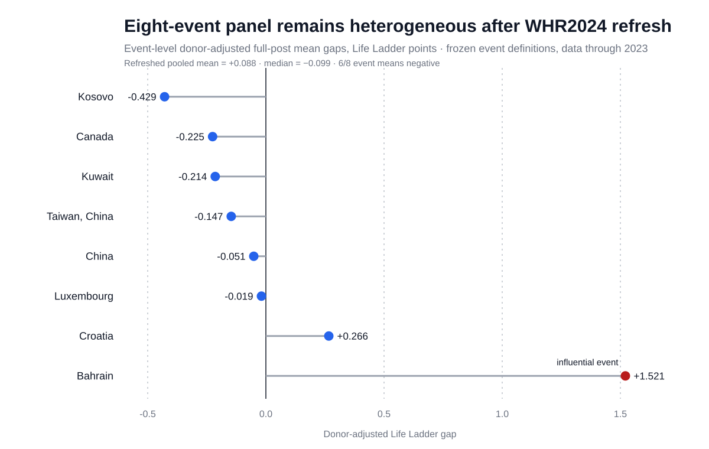

# 法定带薪年休假与国家生活评价

## 全球法律事件审计与证伪优先的独立留出检验

**Cochrane Kang**  
**ARIS4C019 — 中文仓库最终版 v0.6**  
**日期：2026-09-24**

### 摘要

法定带薪年休假可能改善福祉，但跨国因果识别并不容易。本研究将经核验的法律改革时间与 Gallup / World Happiness Report 的逐年 Life Ladder 数据结合，并严格区分法定年休假、公共假日、实际工作时长与实际休假使用。

原始 8 个改革事件的 donor-adjusted 结果表面上呈正向均值（+0.110），但中位数为 −0.099，8 个事件中 5 个为负。使用 WHR2024 逐年数据延长至 2023 年后，在保持原设计不变的情况下，均值降至 +0.088，中位数仍为 −0.099，6/8 个事件为负；去掉最具影响力的 Bahrain 后，均值变为 −0.117。现代 staggered DiD 诊断同样没有提供干净的因果支持，而法律审计显示，原始事件大多属于更广泛的劳动法或休息制度政策包，而非单独的年休假改革。

因此，我们又进行了两轮结果盲法律审计。对剩余 11 个 World Bank 年休假跳点的有界核验没有新增任何干净的 leave-specific holdout。随后比较 WORLD 2015/16 与 Equal Futures 2026 两期法律快照，发现 Israel 2016 年《Annual Leave Law》专项修法是一个更干净的独立事件。在查看 Israel 的结果前，我们冻结了：2015 为 reference，2016 为过渡年并排除，2017–2020 为完整 post window，以及 115 国严格 donor pool。

冻结主规格得到的 Israel full-post 平均 gap 为 +0.002，且没有触发预设 pretrend 警报。但事后基线敏感性诊断显示，若使用更早年份或多年前均值作为基线，结果可下降到约 −0.34 至 −0.18。因而，本研究不能把 +0.002 解读成“精确零效应”。

综合来看，当前可复现的逐年 Life Ladder 数据并未显示法定年休假改革具有稳定、方向一致的国家人口层面效应。更重要的发现是：跨国政策研究中的法律事件污染、暴露—结局错配和参考年份敏感性，会显著改变看似直观的结论。本研究并不意味着实际休假或带薪休假对劳动者个体福祉没有作用。

**关键词：** 带薪年休假；假期；生活满意度；Life Ladder；工作时间；法律流行病学；双重差分；事件研究；政策评估

---

## 1. 研究问题

本研究不问“休假多的国家是不是更幸福”这种静态相关问题，而问：

> 在一国法律明确增加法定带薪年休假之后，其逐年的国家 Life Ladder 轨迹是否出现稳定变化？

## 2. 核心构念边界

“休息时间”至少分为四类：

1. 法定带薪年休假 entitlement；
2. 法定公共假日；
3. 实际年/周工作时长；
4. 实际休假使用。

本研究 leave-specific track 的处理变量只允许使用第一类。

## 3. 数据与设计

主要结局是 Gallup / World Happiness Report 的逐年 **Life Ladder（0–10）**，而不是世界幸福排名，也不是三年滚动平均排名。

第一轮分析使用 WHR2023 的逐年历史面板，之后以 WHR2024 的逐年面板做 source-refresh robustness。正向情绪与负向情绪虽然预先设为 secondary outcomes，但本篇 Pilot-0 工作稿仍保持关闭。

法律时间以官方或一级法律来源为准；World Bank Employing Workers 只作为历史筛查与旁证，不作为最终法律权威。

## 4. 原始 8 事件结果

原始 donor-adjusted full-post：

- 均值：**+0.110**
- 中位数：**−0.099**
- 5/8 个事件为负
- Bahrain 是最主要的正向影响事件

WHR2024 刷新后：

- 均值：**+0.088**
- 中位数：**−0.099**
- 6/8 个事件为负
- 去掉 Bahrain：**−0.117**

因此，不能把最初的正均值解释为稳定的“年休假提高幸福感”。

*图1。八个事件的 donor-adjusted full-post gap。Bahrain 的大幅正值使 pooled mean 对单一事件高度敏感。*

## 5. 法律事件隔离

对 11 个剩余 World Bank 年休假跳点逐一核验后，**0/11** 成为新的干净 leave-specific holdout。

常见问题包括：

- 综合劳动法改革；
- 数据跳点年份与法律生效年份不一致；
- 只覆盖特定地区/司法辖区；
- 没有找到实际法定 entitlement 变化，提示可能是单位、工龄结构或数据库编码变化。

*图4。数据库跳点或法律快照差异只用于生成候选，必须在查看候选结局前完成独立法律核验。*

## 6. Israel 独立 holdout

Israel 2016 年修法直接修改《Annual Leave Law》，不是综合劳动法重写。

改革分两阶段：

- 2016-07-01 增加第一天；
- 2017-01-01 再增加一天。

在结果打开前冻结：

- T = 2016；
- reference = 2015；
- 2016 排除为部分暴露过渡年；
- 完整 post = 2017–2020；
- strict donor pool = 115 国。

冻结主规格 post gaps：

| event time | 年份 | gap |
|---:|---:|---:|
| +1 | 2017 | +0.177 |
| +2 | 2018 | −0.265 |
| +3 | 2019 | +0.114 |
| +4 | 2020 | −0.018 |

平均为 **+0.002**。原始 120-donor 规则敏感性为 **+0.010**，donor-median counterfactual 为 **+0.008**；标准化 leave-one-region-out 结果也仍围绕零附近。

*图2。严格 115 donor、预先冻结 2015 reference 下的 Israel donor-adjusted event-time gaps。*

但事后 reference sensitivity 显示：

- 2013 作为参考：约 **−0.306**
- 2014：约 **−0.337**
- 2013–2015 均值：约 **−0.219**
- 2012–2015 均值：约 **−0.175**

因此，最合理的表述不是“零效应”，而是：

> **没有观察到对基线选择稳定的国家人口层面变化。**

*图3。替代 reference 是看过结局后的脆弱性诊断，不得替换预先冻结的 2015 主规格。*

## 7. 讨论

当前证据不支持简单的“法定年假越多，国家越幸福”叙事，但也不能推导出“休假没有用”。

原因是两类研究的 estimand 不同：

- 个体层面的 vacation / recovery 文献关注真正休假的劳动者、压力、恢复、工作满意度等；
- 本研究关注的是法律 entitlement 改变之后，整个人口的 annual Life Ladder。

一个只影响部分劳动者的一两天法定 entitlement 增量，本来就可能被国家层面的其他年度冲击淹没。

本研究更重要的结果是方法学上的：

> **先把法律 treatment 定义干净，再谈复杂的因果估计器。**

如果 treatment 本身是综合劳动法政策包，再先进的 DiD 也无法自动把“年休假”单独识别出来。

## 8. 结论

目前可复现的逐年 Life Ladder 证据没有显示法定带薪年休假改革存在稳健、方向一致的国家人口层面效应。

原始正向均值会受到政策包混杂、Bahrain 单一事件、数据版本刷新以及 reference-year 选择的显著影响。更干净的 Israel 独立 holdout 在冻结主规格下接近零，但对事后基线诊断敏感。

因此，本项目的主要贡献不是给出一个“年假幸福系数”，而是展示一套更可信的跨国法律政策评估流程：精确法律事件重建、暴露—结局匹配、结果盲 donor 筛选、source-refresh robustness，以及独立 holdout。

后续最有价值的确认路线是：等待/获取延长到 2024/2025 的真实逐年 Life Ladder 数据，对 Mexico 2023 等 leave-specific 改革进行前瞻性冻结检验；同时优先寻找能与受法律影响劳动者直接匹配的微观结局。
